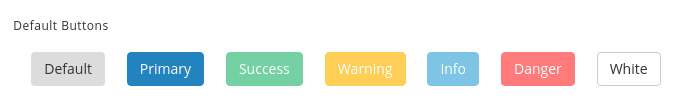
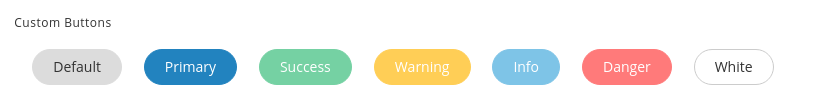
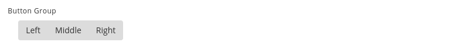

# Buttons

There are three variants of buttons based on the colors used in this template with an option to change the color of the button just by replacing `btn-primary`with `btn-default , btn-info , btn-success, btn-warning, btn-danger`in the code below.

## 1\) Default Buttons :

It has the following design :



It has the following Structure:

```text
<button type="button" class="btn btn-default">Default</button>
```

## 2\) Custom Buttons :

It has the following design :



It has the following Structure:

```text
<button type="button" class="btn btn-default rounded">Default</button>
```

## 3\) Button Group :

It has the following design :



It has the following Structure :

```text
     <div class="btn-group m-l-18">
           <button type="button" class="btn btn-default">Left</button>
           <button type="button" class="btn btn-default">Middle</button>
           <button type="button" class="btn btn-default">Right</button>
     </div>
```

